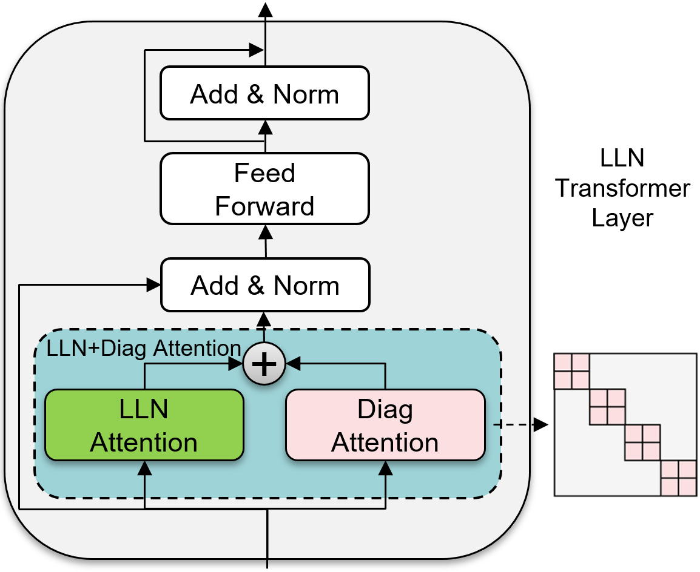

# Linear Log-Normal Attention with Unbiased Concentration

A PyTorch implementation of Linear Log-Normal Attention with Unbiased Concentration - [arxiv](https://arxiv.org/abs/2311.13541).

<p align="center">
    </img>
</p>

## Install requirements
```bash
$ pip install -r requirements.txt
```

## Usage

```python
import torch
from lln.lln_attention import LLNPlusDiagAttention

lin_attn = LLNPlusDiagAttention(size_per_head=64, num_heads=12, eps=1e-5)

q = torch.randn(1, 12, 512, 64)
k = torch.randn(1, 12, 512, 64)
v = torch.randn(1, 12, 512, 64)

# MLM (no mask)
out = lin_attn(q, k, v)

# Language model (causal mask)
mask = torch.tril(torch.ones(1, 1, 512, 512)).type(torch.bool)
out = lin_attn(q, k, v, mask)
```

## Citations

```bibtex
@misc{nahshan2024linear,
      title={Linear Log-Normal Attention with Unbiased Concentration}, 
      author={Yury Nahshan and Joseph Kampeas and Emir Haleva},
      year={2024},
      eprint={2311.13541},
      archivePrefix={arXiv},
      primaryClass={cs.LG}
}
```
